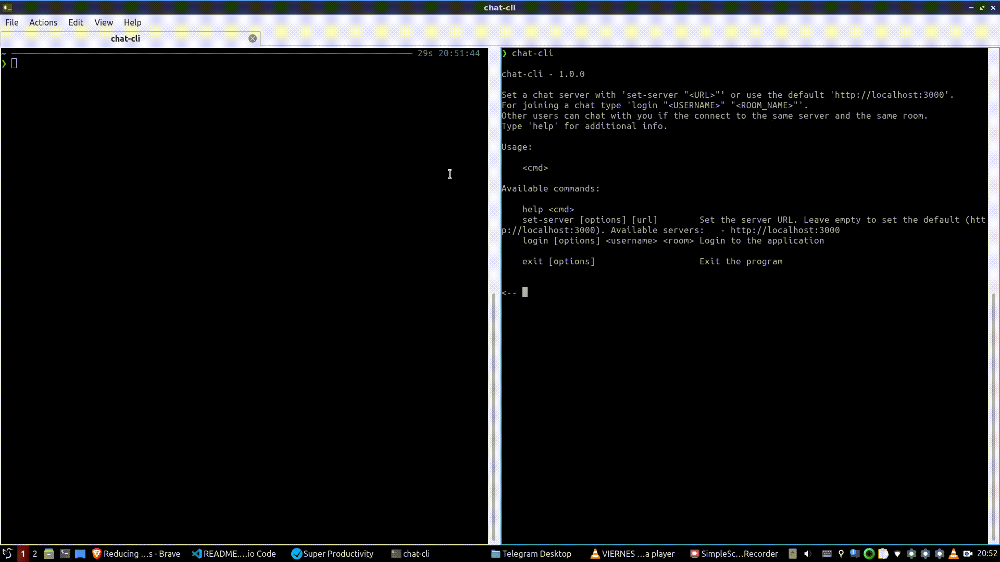
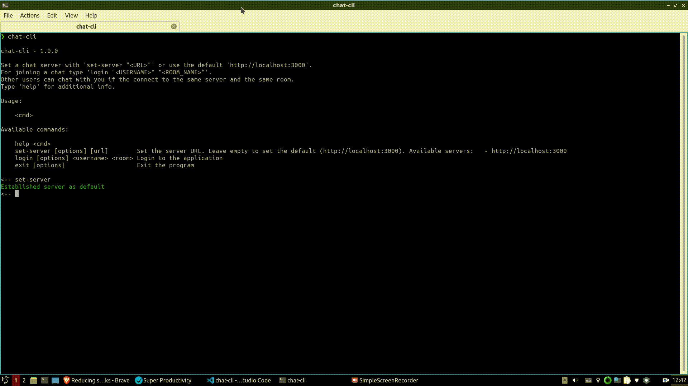

# Real time chat CLI

## About

A Node CLI for real time chat communication with Socket.io.

## Demo

### Chat between two users



### Error connecting to the server



## Features

- Real time message exchange.
- Notifications when another user either joins or leaves the chat room.
- Message timestamp.
- Setting a remote server for communication (see [Deployment](#deployment)).
- Different prompt depending whether the user is logged in or not.

## Running

### Server

Clone the repo and run either `npm start` (or `npm run dev` for using `nodemon`) for starting the server.

### Client

Run `npm run client` for running a client instance. You can also create a symlink with `npm link`. This brings the `chat-cli` command to the `PATH`. Run `npm unlink chat-cli` for unlinking.

## Deployment

As an example, this is how to use the application when deploying with Heroku:

```bash
# Create a new application
$ heroku create
# Deploy the application
$ git push heroku master
```

Then, grab the URL of your Heroku app and connect your client to that server (it's important to always surround your command inputs with quotes, either simple or double):

```bash
$ chat-cli
<-- set-server "<YOUR_HEROKU_APP_URL>"
Established server as <YOUR_HEROKU_APP_URL>
<-- login "<USERNAME>" "<ROOM_NAME>"
Successfully logged in!

Welcome to the <ROOM> chat <USERNAME>!
```

After that, ask some friend in Alaska to do the same. When he's done, both of you can chat in real time (both must use the same room's name).
